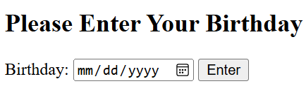
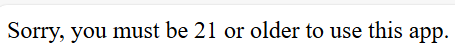
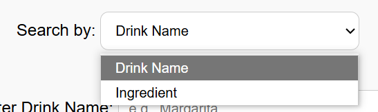
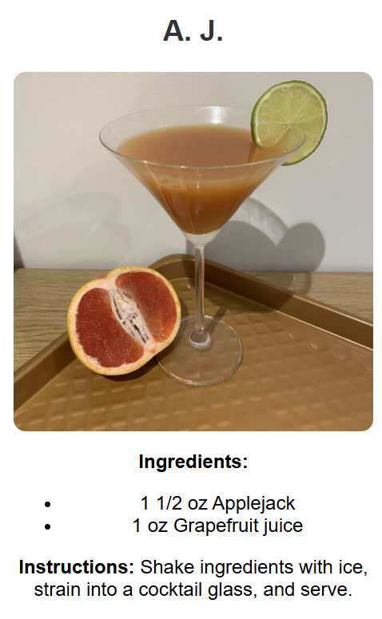
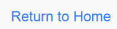
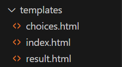

# OIM3640-Final-Project
Kimia and Vicky Final Project for OIM3640

## The Application: 
As college students, we are aware of the drinking habits of our peers and we wanted to provide adults of legal drinking age the opportunity to discover cocktails based on personal taste preferences or available ingredients. By providing the exact measurements to the user's desired cocktails, it helps people make safe, informed, and enjoyable choices when consuming alcohol. The app also helps to promote moderation and awareness by providing information on alcohol content.

## User Instructions for the Website:

As the legal drinking age in the United States is 21 years old, our project verifies that users meet the criteria. The website first prompts the user to enter their birthday. 

If the website calculates that their age is below the age of 21, a simple message shows up informing the user that they're too young.

If the website calculates the user to be of legal age, the user is taken to the next page that displays the "Cocktail of the Day". 

For a more specific search, scroll down and choose whether you want to search by a particular drink name or certain ingredient (choices are given for different types of alcohol).

Once you hit the enter button, the search results will appear. If you chose to search by the drink name, all cocktails with that name in the database will show up with a picture, the ingredients needed to make the drink, and clear and concise instructions on how to make the drink.

If you want to search for a different drink, there is a "Return to Home" button at the bottom of the website and start again.

## Walkthrough of the Code:

The code contains three templates for the website in html. The index.html file codes the front end of the first page that verifies the age of the user.

The choices.html is the second page that the user is brought to if they are of legal drinking age. It contains that code that displays the imaging of the cocktail of the day and the form for the user to use dropdowns to select their search type and the text box for the more specific searching.

The last template is result.html that structures the front end of their results tab in a way that makes it easily available for the user.

For the back end of the project, the "cocktail_backend.py" ties in all of the functions of the website and the front end. Using python, we were able to search through the json file for the necessary information that we wanted to display. Within this file, we also used flask to create different routes for the website and their functionalities.

In the static folder, is a css file that we applied to HTML to improve the overall aesthetics of the website throughout the whole user experience. 

## Running the Code:
To run the code, three packages must be installed and ran- Flask, DateTime, and Requests. Flask is the package that allows us to create and manage the web application by handling routing and rendering templates. DateTime helps manage and format the time-related data, like the age of the user. Requests allows the application to send and receiv data from external sources, like the file that stores the cocktail database. 

Flask and Requests can be used by entering "python -m pip install *APPLICATION*" in your command prompt. DateTime comes preinstalled in Python, so importing it at the top of the code is the only step to using the package.

The database that we use does not require an API key or have any pay walls. It is a ewbsite in JSON format that anybody can access and we have implemented it into the code, so it will run when the code is ran.

## Project Evolution:
As we are quickly approaching the end of our Senior Year at Babson College, we were faced with all of the changes and mixed emotions that come with post-graduation. At the very beginning of this project, we wanted to build an application that would suggest where in the Boston area a person should look for rentals based on a variety of different factors. However, due to pay walls, we could not access a free API that would allow us to do this. After searching for a while with no results, our gears shifted and still with the ending of senior year on our minds, we wanted to create something enjoyable and would help people have fun but in a safe manner. We quickly found a json file that contained a multitude of cocktails and everything we needed to know about how to make them. From there we began making the application with the information available. 

## Attribution: 
To guide us in this project, we utilized ChatGPT to help review our code for efficiency and check for any redundancies. We also used ChatGPT for additions that would improve our website and the user interface. For example, we used css to improve the aesthetics of our website and having not used it before, ChatGPT allowed us to do so.